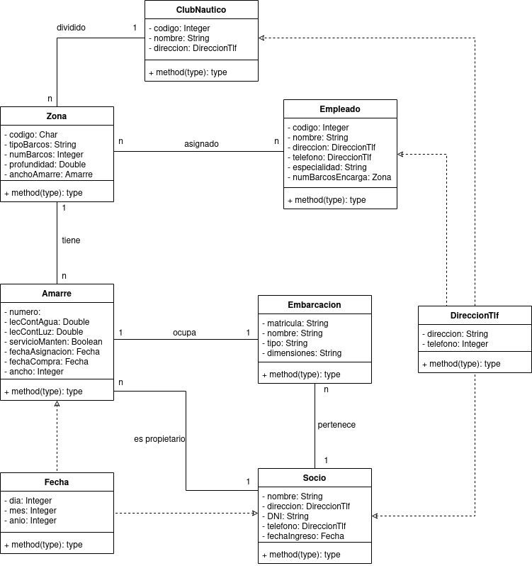

  

### Clases: ### 
> A parte de las nombradas en el texto, creé las clases “Fecha” y “DireccionTlf” porque se repetían sus atributos varias veces y varios atributos.

---
### Relaciones: ### 
> Todas las relaciones menos las que son de las clases “DireccionTlf” y “Fecha” son asociativas ya que se conectan de “tu a tu”, es decir, el contacto entre clases por así decirlo es palpable o físico, sin heredar de las demás ni nada por el estilo.

---
### Cardinalidades: ###  
> Todas y cada una de ellas están definidas en el texto proporcionado.

---
### Atributos: ###
> Los atributos “anchoAmarre” y “numBarcosEncarga” son atributos que he considerado que deberían de estar relacionados con sus clases ya que ponerlos de nuevo en las clases a las que están asociadas sería a mi parecer sobreescribir esas variables. 
